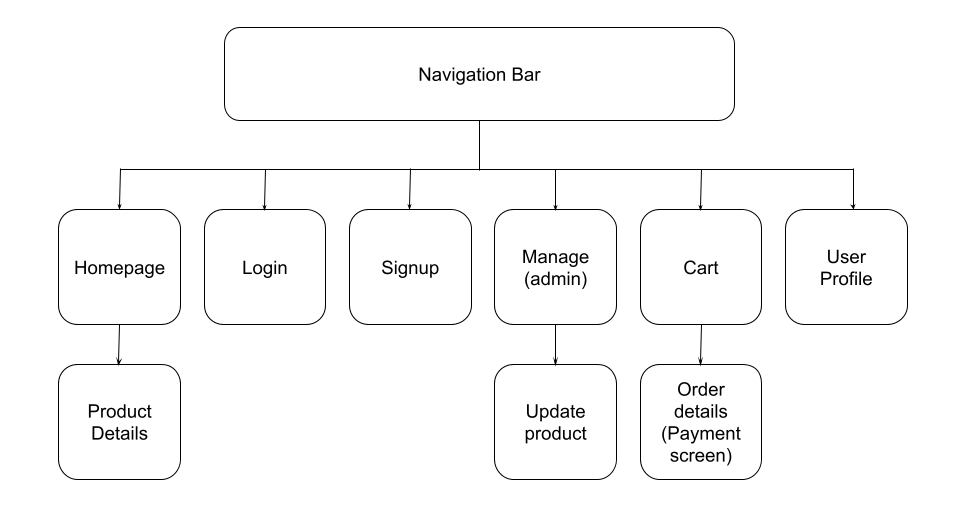

# Bookstore

Bookstore made for Web Development classes at Universidade de Sao Paulo.

### Group members:

- André Luís Mendes Fakhoury
- David Cairuz da Silva
- João Guilherme Madeira Araújo

## 1. Requirements

- There must be 2 types of users: customers and admins.
  - Customers are users who access the system to buy books.
  - Administrators are resposible for managing users and products. The default admin account is `admin` with password `admin`.
- The admin record includes: name, id, phone, email.
- Customer records include:  name, id, address, phone, email.
- Product records include: book title, book author, book genre/category, id, photo (book cover), description, price, quantity in stock, quantity sold.
  - Book categories can be: biography, classics, comics & mangas, fantasy & sci-fi, humor and romance.
- Process of ordering book(s): select products and quantity and add to the cart. The order is purchased using a credit card number (any number is accepted). The quantities of each of the sold products are updated in the system: subtract the quantity in stock and add to the quantity sold. Carts are empties only after payment or by customers choice.
- Product management: admins can create, update, read and delete (CRUD) book records (e.g. quantity in stock, book category).
- After a book is selected and its description is displayed, "related books" are also displayed - for instance, books within the same category or writen by the same author.
- The system must provide accessibility requirements and provide good usability. The system must be responsive.

## 2. Project description

The project is an online bookstore. The server will store information for books and clients. Book information contains id, title, author, description, photo, category, price, quantity in stock/sold and a path to its cover image. Customer information contains id, name, address, email, password, phone number and a flag informing if the user is an admin.

### System functionalities

- Client login and signup (by mail/password);
- View user profile (and update personal information);
- Admin management page (manage user accounts and products)
- Homepage
- View product details (book descriptions) and related products, with an add to cart option;
- View cart items (and update quantities for each book), final price and finish order;
- Payment by credit card number;

Screen mockups are available in this repository and can be found in [mockup](/mockup) folder. They were made using figma ([direct link to the project](https://www.figma.com/team_invite/redeem/OtrAGOx4hGXPKdNo4IbMe0)).

### Navigation diagram

## 3. Comments about the code

Bootstrap is being used to facilitate the design model and development.

## 4. Test plan

The application was built and tested using Firefox and Google Chrome, on the most famous Operational Systems available: Windows, Linux (Ubuntu/Mint) and MacOS.

## 5. Test results

The site behavior seems to be flawless, with everything working correctly and with a short response time. The design is responsive, working as expected on both mobile and desktop.

## 6. Build procedures

It's necessary to have `npm` previously installed.

First of all, clone this repository locally in your machine, and unzip it somewhere;

Then install all dependencies: `npm install`;

Start localhost instance: `npm start`;

Start the mock json database: `npm run server`;

After that, the server will be up and running on `localhost:3000/`, and the mock database will be available at `localhost:5000`.

## 7. Problems

No comments yet.

## 8. Comments

Some of frameworks, libraries and technologies used were:
- Figma (mockup)
- Bootstrap (CSS)
- React (front-end)
- JSON-server (DB mockup)
